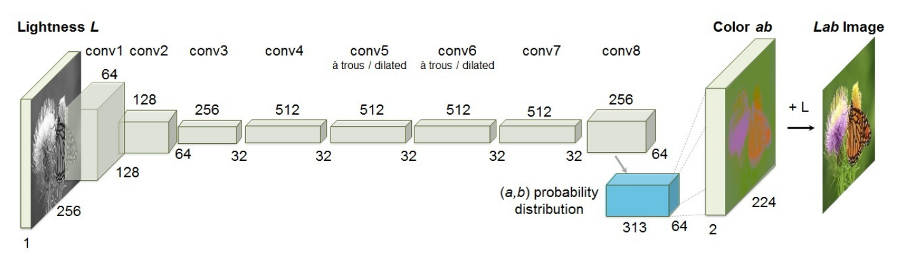

## Proposal
### Summary
We are going to implement and optimize a deep learning algorithm that generates plausible colored versions of black and white photos.

### Background
Our project is inspired by the work of Richard Zhang, Phillip Isola, and Alexei A. Efros from UC Berkeley. They configured a convolutional neural network (using a deep learning framework called Caffe) that attempts to automatically colorize a black and white photo. We seek to implement our own colorizer by creating a similar neural network setup that can be parallelized.

This diagram is from their research paper. Given the lightness channels of the input image, the network generates a probability distribution of the *a* and *b* color components.

We will attempt to distribute the network computation across multiple GPU cores, which will speed up calculations but also require additional communication between cores, since the overall network proceeds in layers. Parallelism will be used within each convolution layer to perform operations on each pixel independently. 

### The Challenge
The deep learning network is inherently sequential in that each layer has to complete before the next layer can commence. Because of this, our optimal speedup is restricted. In addition, we will have to think about how to split up work between cores based on our representation of the image and the blocked nature of the convolution computation, in order to take advantage of cache benefits, SIMD capabilities, and shared memory in thread blocks. We will have to analyze the problem further to determine the extent to which parallelism will improve speedup without introducing too much communication overhead.

### Resources
Our project idea is inspired by this algorithm:
[Colorful Image Colorization](https://arxiv.org/pdf/1603.08511.pdf)
Richard Zhang, Phillip Isola, and Alexei A. Efros. 2016.

They used the deep learning framework Caffe to perform their algorithm.
[Caffe: Convolutional Architecture for Fast Feature Embedding](https://github.com/BVLC/caffe)
Jia, Yangqing and Shelhamer, Evan and Donahue, Jeff and Karayev, Sergey and Long, Jonathan and Girshick, Ross and Guadarrama, Sergio and Darrell, Trevor. 2014.

We will try to implement our own colorizer algorithm using a parallelizable neural network that is customized for this task. Caffe is a general deep learning framework, so we will identify opportunties for parallelism that are problem-specific and incorporate them into our algorithm.

### Goals and Deliverables
What we plan to achieve:
- Implement a simple colorizer algorithm with a basic, sequential network with one thread of control (we can reference the UC Berkeley research paper for guidance on the algorithm, and apply our knowledge about neural networks from 10-601).
- Transform the sequential algorithm to run with CUDA on an NVIDIA GPU (similar to Assignment 2)
- Distribute work among cores by analyzing and identifying workload characteristics of the algorithm.
- Try to further improve performance by considering other techniques like shared memory and cache usage. 

Our final deliverable will be a webpage featuring a widget that will allow users to upload a black and white photo. We will run our algorithm on their photo to generate a plausible coloring. Our algorithm has to perform well enough so that user will not grow impatient while waiting to see their transformed photo. We hope to achieve performance that is competitive with the UC Berkeley Caffe-based implemented that is used in [this widget](http://demos.algorithmia.com/colorize-photos/).

We will demo this widget and show speedup graphs during our presentation.

### Platform Choice
We will will run the parallel version of our algorithm of the GHC machines with the NVIDIA GPUs using CUDA. 

### Schedule 
April 10 - 13: Familiarize ourselves with the UC Berkeley project, Review CNN concepts

April 13: Start implementing baseline algorithm

April 19: Finish implementing baseline algorithm

April 22 - 25: Translate parallelizable section of the algorithm into CUDA

April 26 - May 3: Determine optimal distribution of work among cores

May 4 - 9: Further improve performance to achieve acceptable speedup

May 10 - 11: Implement demo width, Prepare for presentation

